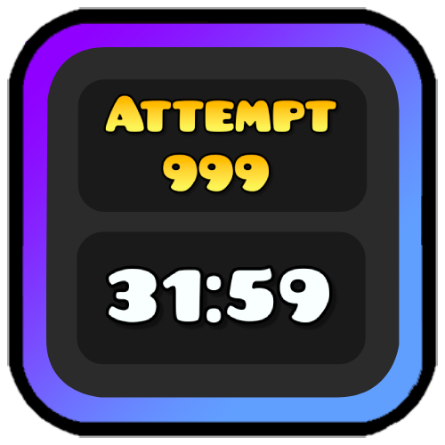

# Attempt Utilities
A mod that allows you to commit several attempt related activities.



## Build instructions
For more info, see [The Geode docs](https://docs.geode-sdk.org/getting-started/create-mod#build)
```sh
# Assuming you have the Geode CLI set up already
geode build
```

For more, see the [about.md](/about.md).
